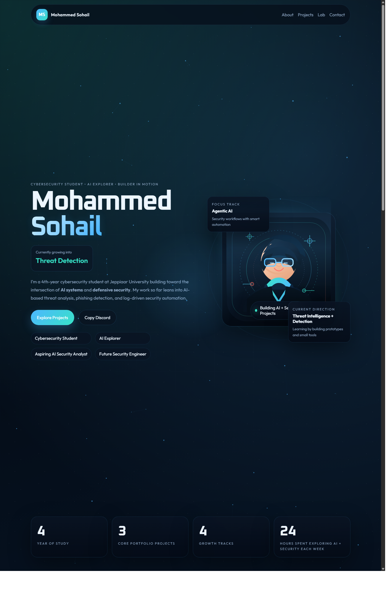
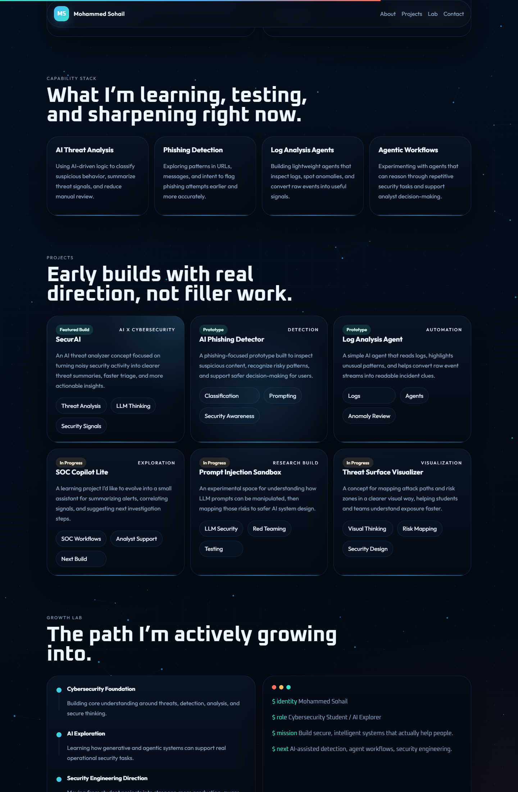

# Mohammed Sohail Portfolio

A custom portfolio website for Mohammed Sohail, a 4th-year cybersecurity student at Jeppiaar University exploring cybersecurity, agentic AI, generative AI, and security engineering.

[Live Demo](http://mohammed-sohail-portfolio.netlify.app) • [GitHub Repo](https://github.com/Sonu0070/mohammed-sohail-portfolio) • [LinkedIn](https://www.linkedin.com/in/mohammed-sohail-65013928b?utm_source=share_via&utm_content=profile&utm_medium=member_android)

## Preview





## About The Site

This portfolio was designed as a cinematic single-page experience with a cyber-control-room mood. It presents Mohammed Sohail as:

- Cybersecurity Student
- AI Explorer
- Aspiring AI Security Analyst
- Future Security Engineer

The content focuses on an honest early-career builder story with projects around AI threat analysis, phishing detection, and log analysis agents, while also showing in-progress directions that fit long-term growth in AI-assisted security.

## Features

- Anime-inspired cyber visual identity
- Animated network background and motion-driven hero section
- Rotating role text and interactive micro-interactions
- Project cards for current and in-progress work
- Netlify-powered contact form with honeypot protection
- Responsive layout for desktop and mobile

## Tech Stack

- HTML5
- CSS3
- JavaScript
- Netlify Forms
- GitHub

## Local Development

You can open `index.html` directly, but using a local server is better for testing:

```powershell
python -m http.server 4173
```

Then open `http://127.0.0.1:4173`.

## Project Structure

- `index.html` - main markup
- `styles.css` - layout, theming, responsiveness, animations
- `script.js` - interactivity, loader, cursor glow, scroll effects, canvas network
- `success.html` - Netlify form success page
- `assets/anime-avatar.svg` - custom anime-style profile artwork
- `docs/` - README screenshots
- `netlify.toml` - Netlify configuration

## Contact

- GitHub: [Sonu0070](https://github.com/Sonu0070)
- LinkedIn: [Mohammed Sohail](https://www.linkedin.com/in/mohammed-sohail-65013928b?utm_source=share_via&utm_content=profile&utm_medium=member_android)
- Discord: `sonu070102`
